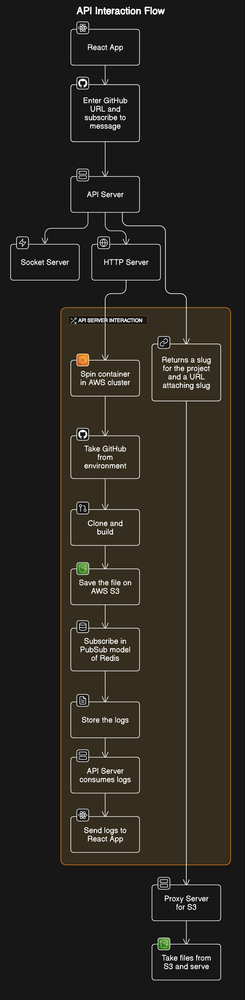

# CloudLaunch

A somewhat simplified vercle-clone that allows users to input a GitHub repository URL, deploy the repository, and view deployment logs in real-time via WebSocket communication, besides of course, providing the live link of the deployment on the AWS service. 

### Prerequistes for the project:
* Nodejs
* Docker
* Amazon Web Services (AWS)
  * ECS
  * ECR
  * S3 bucket
  * Lamda
* redis.

### Setup Guide

This Project contains following services and folders:

- `api-server`: HTTP API Server for REST API's
- `build-server`: Docker Image code which clones, builds and pushes the build to S3
- `s3-reverse-proxy`: Reverse Proxy the subdomains and domains to s3 bucket static assets

### Local Setup

1. Run `npm install` in all the 3 services i.e. `api-server`, `build-server` and `s3-reverse-proxy`
2. Docker build the `build-server` and push the image to AWS ECR.
3. Setup the `api-server` by providing all the required config such as TASK ARN and CLUSTER arn.
4. Run `node index.js` in `api-server` and `s3-reverse-proxy`

### Commands:

```[bash]
cd api
npm install
npm start
```

```[bash]
cd ..
cd s3ReverseProxy
npm install
npm start
```

```[bash]
cd ..
cd vercel-clone-ui
npm install
npm run dev
```
Done, your applicaion should be running on the port 5173. Browse to [http://localhost:5173/](http://localhost:5173/)

At this point following services would be up and running:

| S.No | Service            | PORT    |
| ---- | ------------------ | ------- |
| 1    | `api-server`       | `:9000` |
| 2    | `socket.io-server` | `:9002` |
| 3    | `s3-reverse-proxy` | `:8000` |

## Architecture
This is the simplified System Design and Architecture of the project.




